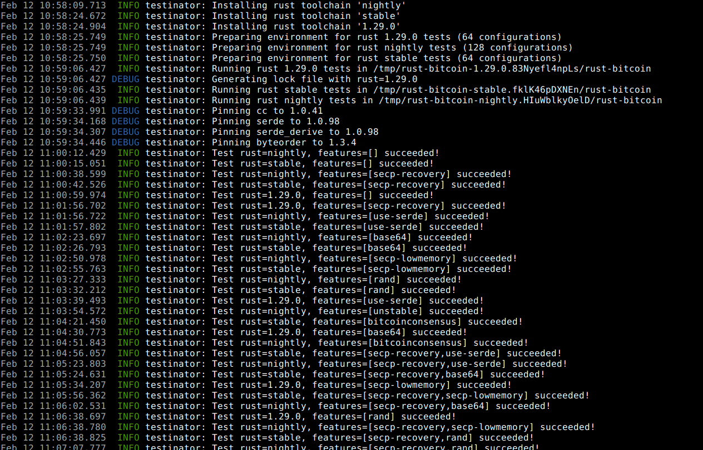

# Local testing tool for the rust-bitcoin ecosystem

## Usage
`testinator` is mostly controlled via configuration files, one for each project. A few command line options exist and
may be extended in the future:
  * `--install`: install the required toolchains through rustup
  * `--simple`: don't run all configurations, run: no features, all features, each feature alone

```
testinator path/to/config.json [--install]
```

The basic functions are:
* optionally install toolchains
* copy project to temporary folders, one per rust version (the number of these folders that exist at the same time is
limited by the `par` config option)
* calculate the test matrix per rust version (all possible feature combinations)
* run all test configurations
* optionally run all fuzz tests in the end

During normal operation only logs are written, only if tests fail their output is also printed for debugging purposes.

Example output for the included [rust-bitcoin configuration](examples/rust-bitcoin.json):



## Config
```json5
{
  "repo": "/home/user/projects/rust-bitcoin", // Path to project files
  "rust": [ // Rust versions used for testing
    {
      "name": "nightly"
    },
    {
      "name": "stable"
    },
    {
      "name": "1.29.0",
      "requires_pinning": [ // Some older rust versions might require dependency pinning
        {
          "dependency": "cc",
          "version": "1.0.41"
        },
        {
          "dependency": "serde",
          "version": "1.0.98"
        },
        {
          "dependency": "serde_derive",
          "version": "1.0.98"
        },
        {
          "dependency": "byteorder",
          "version": "1.3.4"
        }
      ]
    }
  ],
  "features" : [ // The powerset of the specified features will be tested
    {
      "name": "rand"
    },
    {
      "name": "unstable",
      "min_rust": "nightly" // Specify if a feature isn't suitable for certain rust versions
    }
  ],
  "par": 3, // Maximum parallelism, currently limited by number of rust versions (per version the test matrix is currently processes linearly)
  "fuzzing": { // Optional: fuzzing
    "rust": "nightly", // with which rust version to fuzz
    "rel_path": "fuzz", // path of the fuzzing crate
    "duration_s": 60 // time to spend per fuzz test in seconds
  }
}
```